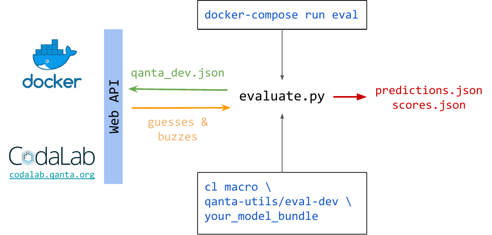

# System Requirements

All systems will take as input a question (sequence of words), and output an
answer guess (a Wikipedia entity) and a binary decision whether to buzz or not.

For example, this command queries a system running locally for what it thinks
the best current answer is as well as whether it is deciding to buzz on the
answer.

```bash
$ http --form POST http://0.0.0.0:4861/api/1.0/quizbowl/act text='Name the the inventor of general relativity and the photoelectric effect'
HTTP/1.0 200 OK
Content-Length: 41
Content-Type: application/json
Date: Wed, 10 Oct 2018 01:12:27 GMT
Server: Werkzeug/0.14.1 Python/3.7.0

{
    "buzz": false,
    "guess": "Albert_Einstein"
}
```

## Input Format
In addition to the `question_text` field shown in the `httpie` sample request we provide a few additional fields.

 * `question_idx`: Question number in the current game.
 * `char_idx`: This corresponds on the server to `full_question[0:char_idx]` if `full_question` is the entire question.
 * `sent_idx`: The current sentence number.
 * `text` Question text up to `char_idx`

### Example

```json
{
  "question_idx": 0,
  "char_idx": 112,
  "sent_idx": 0,
  "text": "At its premiere, the librettist of this opera portrayed a character who asks for a glass of wine with his dying wish"
}
```

## Output Format
The output answer to each question is also a json object of two fields
 * `guess` Guessed Wikipedia answer entity
 * `buzz` true/false whether to buzz given the seen question text so far or not

### Example

```json
{"guess": "The_Marriage_of_Figaro", "buzz": true}
```

## Code Requirements

The first requirement we enforce on all systems is that if the current working
directory is the contents of `src/`, and if we run `bash run.sh` that it will
start a web server satisfying the input/output formats outlined above.

The second requirement we enforce is that all systems should support a status
API. When we startup your system we will query this API until it is running and
returning a valid response. If it takes to long to detect then the evaluation
script will return an error.

* URL: `/api/1.0/quizbowl/status`
* `ready`: return True if ready to accept requests
* `batch`: True if model accepts batch API (see farther down), False otherwise
* `batch_size`: If `batch` is true, an integer indicating max batch size

# Reference System

We provide sample code which when combined with the provided docker container
can answer Quiz Bowl questions. This should provide an example of how the
codalab server interacts with the container as well as a simple yet
surprisingly effective baseline. The simple system consists of a TF-IDF guesser
and a threshold-based buzzer.

## Installation

You will only need to have [docker](https://docs.docker.com/install/) and [docker-compose](https://docs.docker.com/compose/install/)
installed to run this reference system. You may optionally wish to install [httpie](https://httpie.org) to test the web api.

## Running

To run the reference system we have provided four easy commands to run. All of
these commands use the utility `docker-compose` to do much of the heavy lifting
behind the scenes. Importantly it handles port forwarding and volume mapping so that:

* The directory `src/` is synced to `/src/` in the container
* The directory `data/` is synced to `/src/data` in the container
* The web api is accessible at `http://0.0.0.0:4861`

### Commands

These commands are structured via `docker-compose CMD CONTAINER ARGS` where
`CMD` is a `docker-compose` command, `CONTAINER` is either `qb` or `eval`, and
`ARGS` runs inside of the container.

1. `docker-compose run qb ./cli download`: This will download the training data to `data/`
2. `docker-compose run qb ./cli train`: This will train a model and place it in `src/qanta/tfidf.pickle`
3. `docker-compose up`: This will start the web server in the foreground, `-d` for background, `ctrl-c` to stop
4. `docker-compose run eval`: This will run the evaluation script

Another useful command is `docker-compose down` to shutdown zombied web servers
and scripts. `docker ps -a` will also display all running and stopped
containers. `docker-compose logs` will show all the container logs together.


### Test Web API
After you have run (1) and (2), you can test everything works by running

```bash
docker-compose up
```

And then the `httpie` command from before:

```bash
$ http --form POST http://0.0.0.0:4861/api/1.0/quizbowl/act text='Name the the inventor of general relativity and the photoelectric effect'
HTTP/1.0 200 OK
Content-Length: 41
Content-Type: application/json
Date: Wed, 10 Oct 2018 01:12:27 GMT
Server: Werkzeug/0.14.1 Python/3.7.0

{
    "buzz": false,
    "guess": "Albert_Einstein"
}
```

### Batch Web API

WIP: More updates coming soon

GET URL: `/api/1.0/quizbowl/status`

Output:
```json
{
  "batch": true,
  "batch_size": 200,
  "ready": true
}
```

# Codalab

These instructions show you how to setup and run a codalab compatible model locally, but to submit to codalab you should follow the instructions at [codalab.qanta.org](http://codalab.qanta.org/).

The diagram below shows how Docker, codalab, and the evaluation scripts are related.



At a high level:
1. You submit your code/model for evaluation by running either the `docker-compose` command or the codalab macro.
2. Whichever way you submitted, the evaluation script assumes that running `src/run.sh` will start your web server
3. The evaluation script will run questions against the web API endpoint `/api/1.0/quizbowl/act`
4. The evaluation script will output your scores to the standard out locally, or post to the leaderboard when run on codalab.


# Maintainer Notes

## Dockerhub

The default docker-compose file references the published image for quizbowl at
https://hub.docker.com/r/entilzha/quizbowl/

To push new images requires the correct permissions and running the following
commands in sequence:

```bash
docker-compose -f docker-compose.dev.yml build
docker tag qanta-codalab_qb:latest entilzha/quizbowl
docker push entilzha/quizbowl
```

## Codalab CLI

Install with anaconda python using

```bash
$ conda env create -f codalab_cl_env.yml
$ source activate codalab
$ #config.fish: source ~/anaconda3/etc/fish/conf.d/conda.fish
```
